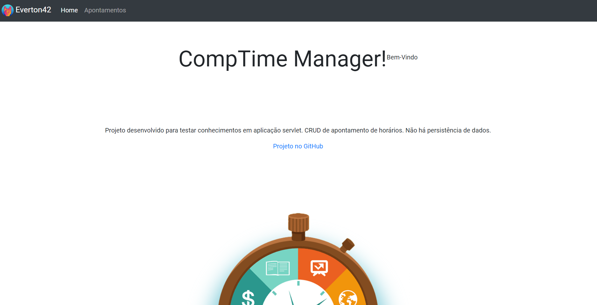
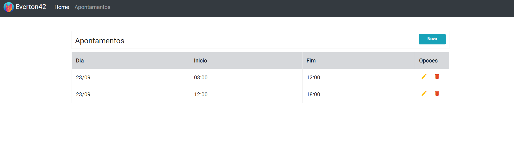
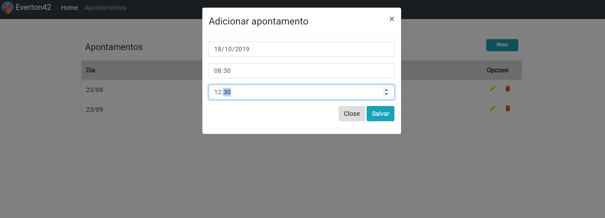

# CompTimeManager
Projeto com arquitetura MVC para praticar estudo sobre servlet. CRUD de apontamento de horas trabalhadas com uso de filtro de autenticação e validação por sessão.  
Os dados são armazenados apenas em tempo de execução.

Ferramentas utilizadas:  
-Maven   
-Bootstrap  
-Jstl  
-Plugin hot deploy tomcat 

Login:``Everton42 - 12345 ``  
Url: ``http://localhost:8080/CompTimeManager/entry?action=Login``

